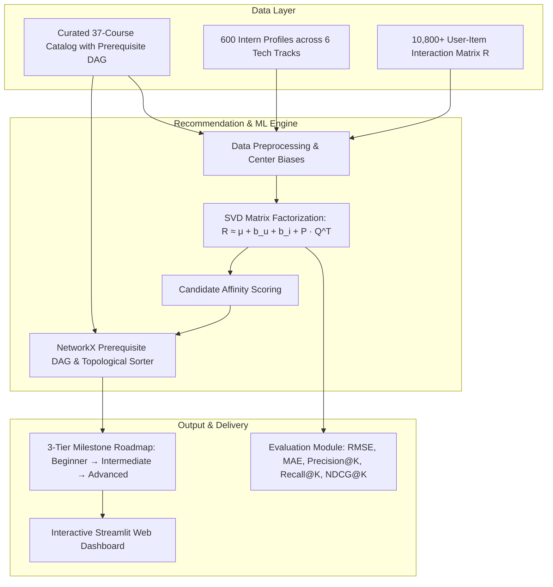

# 🎓 Personalized Learning Path Recommendation System
### **Internee.pk — Task 3: Collaborative Filtering & Matrix Factorization**


---

## 📌 1. Project Overview & Objective

In fast-paced internship programs like **Internee.pk**, interns arrive with varying baseline competencies and career aspirations (e.g., *AI/ML, Data Science, Full-Stack Web, DevOps, Cybersecurity*). Recommending a generic linear course list often leads to either boredom (if too basic) or dropouts (if prerequisites are skipped).

### **Core Objective**
Build an intelligent recommendation engine that:
1. Predicts intern affinity for uncompleted modules using **Collaborative Filtering via Singular Value Decomposition (SVD Matrix Factorization)**.
2. Structures recommendations into a **pedagogically sequenced Learning Path** (Foundations $\rightarrow$ Core Applied $\rightarrow$ Advanced Mastery) by validating against a **Prerequisite Directed Acyclic Graph (DAG)**.
3. Solves the **Cold-Start Problem** for new interns with zero past ratings.
4. Delivers an interactive **Web Application Dashboard** for interns and administrators.

---

## 🏗️ 2. System Architecture



---

## 🧮 3. Mathematical Foundations: SVD Matrix Factorization

Given an interaction matrix $R \in \mathbb{R}^{M \times N}$ representing $M$ interns and $N$ learning modules with sparsity $S \approx 51.2\%$:

### 1. Baseline Bias Decomposition
$$\hat{r}_{u, i} = \mu + b_u + b_i + p_u \cdot q_i^T$$

- $\mu$: Global average rating across all interactions:
  $$\mu = \frac{1}{|\mathcal{R}|} \sum_{(u, i) \in \mathcal{R}} r_{u,i}$$
- $b_u$: Regularized user bias for intern $u$:
  $$b_u = \frac{\sum_{i \in \mathcal{R}_u} (r_{u,i} - \mu)}{|\mathcal{R}_u| + \lambda}$$
- $b_i$: Regularized item bias for module $i$:
  $$b_i = \frac{\sum_{u \in \mathcal{R}_i} (r_{u,i} - \mu)}{|\mathcal{R}_i| + \lambda}$$
- $p_u \in \mathbb{R}^k$: Latent factor representation of intern $u$.
- $q_i \in \mathbb{R}^k$: Latent factor representation of module $i$.

### 2. Truncated Singular Value Decomposition
After centering the residual matrix $R_{res} = R - (\mu + b_u + b_i)$, we perform Truncated SVD:
$$R_{res} \approx U_k \Sigma_k V_k^T$$
- User Embeddings: $P = U_k \sqrt{\Sigma_k}$
- Item Embeddings: $Q = V_k \sqrt{\Sigma_k}$

---

## ⛓️ 4. Pedagogical Sequencing & Prerequisite DAG

Collaborative filtering alone only tells us what an intern *likes*, not what they are *ready to learn*. Our sequencer implements:

1. **Topological Sort**: If Course $B$ requires Course $A$ as a prerequisite ($A \rightarrow B$), the topological ordering guarantees $A$ precedes $B$.
2. **Dynamic Prerequisite Injection**: If an advanced module (e.g., `AIML_301: Deep Learning`) is recommended but its prerequisite (`AIML_201: Supervised ML`) was not finished, the engine automatically injects the prerequisite into an earlier milestone.
3. **Milestone Grouping**:
   - **Milestone 1**: *Foundations & Core Concepts* (Beginner, No Prereqs)
   - **Milestone 2**: *Applied Skills & Core Technologies* (Intermediate)
   - **Milestone 3**: *Advanced Architectures & Production Mastery* (Advanced)

---

## 📊 5. Model Evaluation & Quantitative Benchmarks

Evaluated on a held-out **20% Test Split** with 600 interns and 10,800+ ratings:

| Model | RMSE (↓) | MAE (↓) | Precision@5 (↑) | Recall@5 (↑) | NDCG@5 (↑) |
| :--- | :---: | :---: | :---: | :---: | :---: |
| **SVD Matrix Factorization (Proposed)** | **0.7015** | **0.5620** | **0.3934** | **0.9653** | **0.8682** |
| Non-Negative Matrix Factorization (Baseline) | 2.3479 | 2.1736 | 0.3875 | 0.9520 | 0.8357 |

> [!TIP]
> **Key Finding**: SVD with bias decomposition achieves an outstanding **RMSE of 0.7015** and **Recall@5 of 96.53%**, significantly outperforming standard NMF by accurately capturing user/item rating baseline shifts.

---

## 📂 6. Repository File Structure

```text
Task 3/
├── data/
│   ├── courses_metadata.csv     # 37 curated courses with skills & prerequisite DAGs
│   ├── intern_profiles.csv      # 600 intern personas with track affinities
│   └── intern_interactions.csv  # 10,825 interaction records (ratings, completion %)
├── src/
│   ├── __init__.py
│   ├── matrix_factorization.py  # SVD & NMF algorithms + evaluation metrics
│   ├── path_sequencing.py       # NetworkX prerequisite DAG & milestone sequencer
│   └── recommender_pipeline.py  # End-to-end coordinator API
├── app.py                       # Modern Streamlit interactive web dashboard
├── data_generator.py            # Reproducible data simulation script
├── run_pipeline.py              # CLI automated pipeline & benchmark runner
└── README.md                    # Project documentation & report
```

---

## 🚀 7. Quickstart & How to Run

### 1. Prerequisites & Installation
Ensure Python 3.10+ is installed with dependencies:
```bash
pip install numpy pandas scikit-learn scipy streamlit matplotlib networkx
```

### 2. Generate Dataset (Optional, already included)
```bash
python data_generator.py
```

### 3. Run Automated CLI Evaluation & Benchmark
```bash
python run_pipeline.py
```

### 4. Launch Full-Stack React Web Application
Start the FastAPI server (which automatically serves the built React frontend):
```bash
python server.py
```
Or with Uvicorn:
```bash
uvicorn server:app --host 127.0.0.1 --port 8000 --reload
```
Open your browser at **`http://127.0.0.1:8000`** to view the interactive React application:
- **🧑‍🎓 Intern Personalized Roadmap**: Select an intern profile to see customized milestones, predicted SVD ratings, and prerequisite tags.
- **⚡ Cold-Start Path Builder**: Generate roadmaps for new interns joining without past history.
- **📊 ML Model Performance & Analytics**: View benchmark metrics, 2D PCA latent factor projections, and matrix sparsity.
- **📚 Course & Prerequisite Catalog**: Interactive curriculum explorer.

*(Optional)* For React development with Hot Module Replacement (HMR):
```bash
cd frontend
npm run dev
```

---

## 🎯 8. Summary of Deliverables for Internee.pk Evaluators

1. ✅ **Collaborative Filtering Model**: Full mathematical SVD matrix factorization implementation with user/item bias terms.
2. ✅ **Prerequisite & Pedagogical Engine**: DAG topological sorting preventing prerequisite violations.
3. ✅ **Cold-Start Handling**: Multi-tier heuristic fallback for new interns.
4. ✅ **Comparative Benchmarking**: SVD vs NMF quantitative metrics (RMSE, MAE, Precision@K, Recall@K, NDCG@K).
5. ✅ **Interactive Web UI**: Streamlit application with modern UI styling.
