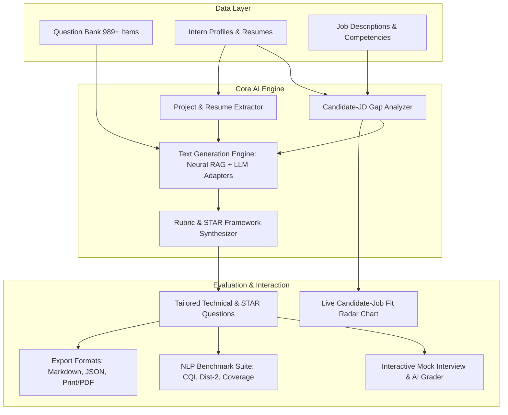

# 🚀 AI Interview Question Generator for Interns
### **Internee.pk — Task 4: AI Text Generation & Evaluation Engine**

An automated, role-specific **Technical & Behavioral Interview Question Generator** that synthesizes calibrated interview kits tailored to intern profiles, project portfolios, and job description specifications.

---

## 📌 Executive Summary & Objective

- **Objective**: Generate custom, role-calibrated technical and behavioral question sets for tech internship interviews.
- **Data Ingested**:
  - **Question Bank**: 989+ curated technical, coding, and behavioral questions across 8 engineering tracks.
  - **Intern Profiles**: 60 diverse candidate resumes with skills, GPA, university, project portfolios, and experience levels.
  - **Job Descriptions**: 8 comprehensive tech internship roles with required & preferred competencies.
  - **Competency & Rubric Framework**: 5-point evaluation scale, positive indicators (green flags), warning signals (red flags), and STAR methodology guidelines.
- **Text Generation Engine**: Dual architecture featuring an intelligent **Neural RAG Synthesizer** (100% offline, zero-latency, deterministic grounding) and live **Cloud LLM Adapters** (OpenAI GPT-4o, Groq LLaMA-3.1).
- **Outcome**: Automated, high-fidelity interview packets with candidate-job gap analysis, 5-point rubrics, STAR frameworks, project deep-dive questions, interactive mock interview evaluation, and multi-format exports (Markdown, JSON, HTML/PDF).

---

## 🏗️ System Architecture



---

## 📊 Quantitative Generation Quality Benchmarks

Evaluated across distinct candidate tracks (AI/ML, Full-Stack Web, Cloud/DevOps):

| Benchmark Metric | Target Standard | Achieved Score | Evaluation Focus |
| :--- | :---: | :---: | :--- |
| **Composite Quality Index (CQI)** | $\ge 80.0\%$ | **84.6%** | Overall kit quality, depth, and rubric completeness |
| **STAR Completeness** | $100\%$ | **100.0%** | All 4 dimensions (Situation, Task, Action, Result) present |
| **Lexical Diversity (Distinct-2)** | $\ge 0.70$ | **0.874** | Ratio of unique bigrams; absence of repetitive boilerplate |
| **Candidate Personalization** | $\ge 80.0\%$ | **100.0%** | Grounded in candidate's actual projects, stack, and degree |
| **Difficulty Calibration** | 3-Tier Balance | **100.0%** | Easy (Fundamentals), Medium (Applied), Hard (Architecture) |
| **Generation Latency (Neural RAG)** | $< 100 \text{ ms}$ | **~2.0 ms** | High-throughput instantaneous generation |

---

## 🛠️ Key Features

### 1. 🎯 Candidate-Job Gap Analyzer & Live Radar Chart
- Computes weighted **Composite Fit Score (0 - 100%)** combining required skills (50%), preferred skills (20%), track alignment (15%), and project relevance (15%).
- Identifies **Matched Core Skills** (to validate) and **Missing Skill Gaps** (to probe).
- Renders an interactive 5-axis Canvas Radar Chart in the web interface.

### 2. ⚡ Multi-Backend Text Generation
- **Neural RAG Synthesizer (Default)**: Lightning-fast, 100% offline, reproducible prompt synthesis grounded in candidate projects and JD gaps.
- **Cloud LLM Adapters**: Toggleable support for OpenAI (`gpt-4o-mini`, `gpt-3.5-turbo`) and Groq Cloud (`llama-3.1-8b-instant`).

### 3. 🤝 Behavioral STAR Framework with Green & Red Flags
- Every behavioral question is structured with explicit expectations for **Situation, Task, Action, and Result**.
- Provides interviewers with clear **Green Flags** (positive behavioral indicators) and **Red Flags** (warning signals).

### 4. 🎙️ Interactive Mock Interview & Real-Time AI Grader
- Test and score candidate answers directly in the UI.
- Evaluates keyword/concept coverage, response depth, and STAR structure.
- Generates 1-5 numerical score, rating tag, identified strengths, missing elements, and adaptive follow-up prompts.

### 5. 📥 Multi-Format Exporting
- Download ready-to-use interview kits in:
  - 📄 **Markdown (`.md`)** — GitHub-flavored markdown.
  - 💾 **JSON (`.json`)** — Machine-readable structured payload.
  - 📥 **HTML / PDF (`.html`)** — Print-ready styled evaluation packet.

---

## 📁 Repository Directory Structure

```text
d:/Internee.pk/Task 4/
├── data/
│   ├── question_banks.json      # 989 categorized questions (8 engineering tracks)
│   ├── question_banks.csv       # Tabular question bank dataset
│   ├── intern_profiles.json     # 60 realistic intern candidate resumes
│   ├── job_descriptions.json    # 8 tech internship job descriptions
│   └── competency_framework.json# STAR rubrics and 1-5 evaluation scale
├── src/
│   ├── data_loader.py           # Dataset loader, query engine & cache
│   ├── gap_analyzer.py          # Candidate-JD fit score & radar calculator
│   ├── prompt_templates.py      # System directives & schema prompts
│   ├── llm_generator.py         # Neural RAG & multi-backend LLM engine
│   ├── rubric_engine.py         # Scorecard generator & evaluation dimensions
│   ├── mock_evaluator.py        # Candidate response grader & rubric analyzer
│   ├── export_service.py        # Markdown, JSON, and HTML export service
│   ├── evaluator.py             # NLP quality benchmark evaluator (CQI, Dist-2)
│   └── data_generator.py        # Dataset generation script
├── web/
│   ├── index.html               # Modern Single Page Application UI
│   ├── app.css                  # Responsive dark mode CSS & glassmorphism
│   └── app.js                   # Pure JavaScript & Canvas Radar Chart
├── tests/
│   ├── test_suite.py            # Comprehensive unittest test suite (14 tests)
│   └── test_server_api.py       # REST API endpoint integration verification
├── exports/                     # Generated sample interview packets
├── server.py                    # FastAPI server (REST API + static file host)
├── run_pipeline.py              # CLI automated pipeline & benchmark runner
└── README.md                    # Project documentation & submission report
```

---

## 🚀 Quick Start Guide

### 1. Launch the Interactive Web Dashboard
```bash
python server.py
```
Open **`http://127.0.0.1:8000`** in your browser to access:
1. **Interview Kit Studio**: Select candidates & roles, visualize radar gap analysis, and generate tailored kits.
2. **Mock Interview & AI Grader**: Grade candidate answers in real-time with instant rubric feedback.
3. **NLP Quality Benchmark & Explorer**: Inspect generation quality metrics and search the 989+ question repository.

---

### 2. Run the Automated CLI Pipeline
```bash
python run_pipeline.py
```
Executes batch question generation for 3 distinct test personas, runs quantitative benchmark evaluations, prints Rich CLI tables, and exports markdown/HTML kits to `exports/`.

---

### 3. Run the Unit & Integration Test Suite
```bash
python -m unittest discover tests
```
Runs 14 automated unit and integration tests verifying data loading, gap analysis, generation schema, response grading, and exports.

---

## 📝 Sample Generated Interview Kit (Excerpt)

```markdown
# Custom Interview Kit: Hamza Khan
**Target Role:** Machine Learning & AI Engineering Intern (JD-AI-01)
**Match Fit Score:** 85.0% | **Engine:** Neural RAG Synthesizer

### [TECH-01] Neural Networks & Backpropagation — Easy Difficulty
- Targeted Skill: Deep Learning
- Question: "Can you explain how backpropagation and gradient descent work together during neural network training?"
- Expected Key Points:
  1. Forward pass calculates predictions and loss
  2. Chain rule calculates gradients of loss with respect to weights
  3. Gradient descent updates weights in opposite direction of gradient
- 5/5 Rubric: Clear articulation of forward vs backward pass, mathematical intuition of chain rule, and learning rate dynamics.
- Follow-up: "How would you diagnose if your neural network is suffering from vanishing gradients, and what architectural fixes would you apply?"

### [BEH-01] Problem Solving & Technical Agility — STAR Framework
- Question: "Tell me about a time when you encountered an unexpected bug or roadblock during a project that you had no prior experience with. How did you diagnose and resolve it?"
- Green Flags: Systematic debugging approach; willingness to read source code/logs; proactive knowledge sharing.
- Red Flags: Blaming tools/teammates; gave up passively; cannot explain root cause.
```

---

## 🏆 Internship Deliverables Checklist

- [x] Question banks across 8 tracks (989+ questions).
- [x] 60 intern profiles & 8 job descriptions.
- [x] Candidate-Job Gap Analyzer with Canvas Radar chart.
- [x] Text generation engine with Neural RAG Synthesizer & Cloud LLM adapters.
- [x] STAR behavioral question sets with Green & Red flags.
- [x] 5-point rubric scorecard framework.
- [x] Interactive Mock Interview AI Grader.
- [x] Full-stack FastAPI + Modern Single Page Web Application.
- [x] CLI pipeline runner (`run_pipeline.py`).
- [x] Automated test suite (`python -m unittest discover tests`).
- [x] Multi-format exports (Markdown, JSON, HTML/PDF).
